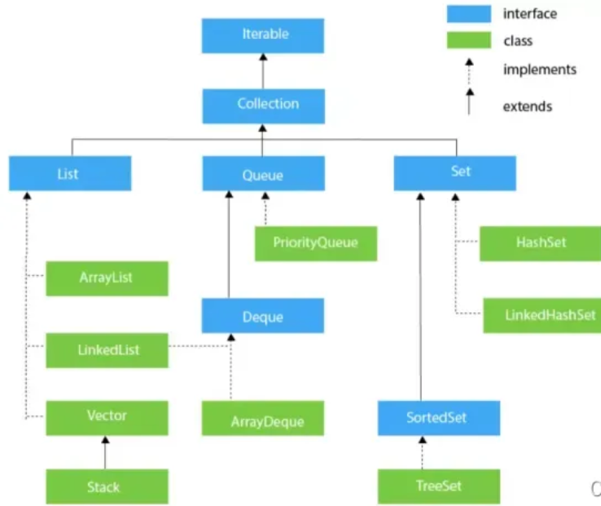

# java相关内容笔记
### 注释
type 表示基本数据类型和包装类  
Object 表示包装类（不包括基本数据类型）和自定义类  
Collection Collection类的实现类和继承类:List,Set
### 基本数据类型 vs 包装类
1. 对比
    | 基本数据类型 | 包装类    |
    | ------------ | --------- |
    | int          | Integer   |
    | long         | Long      |
    | char         | Character |
    | float        | FLoat     |
    | double       | Double    |
    | boolean      | Boolean   |

2. 装箱和拆箱
   + 基本数据类型转换为包装类的过程称为装箱
   + 包装类变为基本数据类型的过程称为拆箱  
    举例：int和Integer的装箱和拆箱
        ```
        int m = 500;
        Integer obj = new Integer(m);  // 手动装箱
        int n = obj.intValue();  // 手动拆箱
        ```
3. 包装类的方法（以Integer为例）
   ```
   int i=1;
   int i2=1;
   Integer in=2;
   Integer in2=3;
   String s="3";
   ```
   + in.intValue() Integer->int
   + Integer.valueOf(i) int->Integer
   + Integer.valueOf(s) String->Integer
   + in.doubleValue()/in.floatValue()/int.longValue()
   + in.compareTo(in2)/Integer.compare(i,i2) -1|0|1
   + Intger.parseInt(s) String->int
   + Integer.MAX_VALUE/Integer.MIN_VALUE
### 列表
1. 数组和java.util.List的区别  
    数组与c++数组性质基本一致，变量指向数组头部的内存地址，固定长度，需要时需要动态创建：
      + 初始化
        ```
        int[] list1=new int[5];
        int[] list2={1,2,3,4,5};
        int[] list3=new int[]{1,2,3,4,5};
        int a=1,b=2;
        int[] list4=new int[]{a,b};
        ```
      + 访问与修改
        ```
        list[1]=3;
        ```  
      + 长度
        ```
        int length=list1.length;
        ```  
    List是一个interface，他有很多方法接口：  
      + 初始化
        ```
        List<Integer> list1=new ArrayList<>(); 
        List<Integer> list2=new LinkedList<>(); //List内部只能是包装类不能是基本数据类型
        ```
        注意：不能用List去初始化List
      + 访问与修改
        ```
        Integer x= list1.get(index);
        list1.set(index,x);
        ```
      + 长度
      + ```
        int length=list1.size();  
        ```   
    相互转化：  
      + List转数组：
        ```
        Integer[] nums=list.toArray(list1)  //list1:List<Integer>
        ```
      + 数组转list：
        ```
        List<Integer> list1=Arrays.asList(nums) //nums:Integer[]
        ```
2. List 接口
   ```
   List<Integer> list=Arrays.asList(1,2,3,4);
   List<Integer> list2=new Arraylist<>();
   ```
   + list.size()
   + list.add(Object o)
   + list2.addAll(list) 深拷贝
   + list.clear()
   + list.contains(Object o)
   + list.indexOf(Object o)
   + list.get(int index)
   + list.remove(int index)
   + list.put(int index,Object value)
   + list.toArray() List<Integer> ->Integer[]
3. java.util.Arrays类-用于对于type[]的处理  
    该类有很多静态方法用于操作数组：
    + List<Integer> list1=Arrays.asList(nums) //nums:Integer[]
      List<Integer> list2=Arrays.asList(int n1,int n2,...)  
      注意:  
      asList不能应用于基本数据类型，例如int[]  
      list1无法进行修改操作，例如add，remove，若要使用以下方式需要：  
      List<Integer> list1=new ArrayList(Arrays.asList(nums))  
    + int[] newArr1=Arrays.copyOf(int[] oldArr,int newLength) 深拷贝，会覆盖，甚至length都会被覆盖    
      此处newLength为拷贝的长度，也是newArr1的长度，如果newLength>oldArr.length，则会补零  
    + int[] newArr2=Arrays.copyOfRange(int[] oldArr,int from,int to)  
      拷贝下标[from,to-1]
    + Arrays.fill(type[] arr,3)
      该方法将list1所有元素都设为3  
      Arrays.fill(type[] arr,from,to,3)
      该方法将list1从from到to-1的所有元素都设为3
    + Arrays.sort(type[] arr)
      该方法将list1升序排列  
      自定义排序方式：
      ```
      int arr[][]={{1,2},{2,3}};
      Arrays.sort(arr,new Comparator<int[]>(){
        @Override
        public int compare(int[] element1,int[]element2){
          if(){
            return 1; //element1>element2
          }else if(){
            return -1; //element<element2
          }else{
            return 0; //不改变原顺序
          }
        }
      });
      ```
    + Arrays.binarySearch(list,key)
      二分查找，必须在此之前用sort，不能保证搜到的是第几个（如果有多个）
    + Arrays.toString(type[]arr) 返回String
      print 数组，可拿来System.out.println
4. List和ArrayList，LinkedList的关系
   List是列表的接口interface，而ArrayList和LinkedList是其实现类，他们继承自List，因此在创建时大部分情况会使用：        
    ```
    List<Integer> list1=new ArrayList<>(); 
    List<Integer> list2=new LinkedList<>();
    ```
    来创建List，即创建一个实现类来赋值给List，一定要注意不能：
    ```
    List<Integer> list3=new List();
    ```
    当使用
    ```
    List<Integer> list1=new ArrayList<>();
    List<Integer> list2=new LinkedList<>();
    ```  
    就会将一个刚创建的ArrayList赋值给List，而此时list1，list2只能使用List类的所有接口  
    而若使用
    ```
    ArrayList<Integer> list1=new ArrayList<>();
    LinkedList<Integer> list2=new LinkedList<>();
    ```  
    则可以list1可以使用ArrayList实现类自己的方法，list2可以使用LinkedList实现类的方法，例如list2.removeLast(),list2.removeFirst()
### 字符串
1. String和char
   string用双引号"",char用单引号
   相互转化：
   ```
   char[] c=str.toCharArray();  //String 转 char[]
   String str=new String(c)   //char[] 转 String
2. String常用方法
   所有的方法都不会改变调用者自己的值，所以都需要使用返回值
   ```
   charAt(int index)
   contains(CharSequence s)
   indexOf(char ch/String str)
   =s.concat(s2)
   s.trim() //" abc "->"abc"
   s.compareTo(s2)  //-1|0|1
   =s.substring(int beginIndex, int endIndex)
   =s.toUpperCase()
   =s.toLowerCase()
   s.split(",") //"a,b,c"->String[] ["a","b","c"]
   s.split("\\s+") //solve multiple space: "a  b c"->["a","b","c"]

   =String.valueOf()
   =String.format("x=%d",10)
   =String.join(",",String[] strArray) //["a","b","c"]->"a,b,c"
   ```
3. StringBuffer
   ```
   StringBuffer sb=new StringBuffer()/new StringBuffer(String)
   sb.reverse()
   sb.insert(int index,String s)
   sb.charAt(int index)
   sb.append(String s)
   sb.delete(int from,int to)
   sb.subString() // 不改变自身
   sb.toString();
   ```
### 集合
1. 方法
  ```
  set.contains(Object o)
  set.add(Object o)
  set.addAll(Collection<Object>)
  set.remove(Object o)
  set.isEmpty()
  set.clear()

  //traverse:
  Iterator<Set> itr=set.iterator();
  while(itr.hasNext()){
    //operation
    itr.next();
  }
  ```
2. 转化
```
List<Integer> list=Array.asList(1,2,3,4);
Set<Integer> set=new HashSet<>();
set.addAll(list);
List<Integer> list2=new ArrayList<>();
list2.addAll(set);
Integer[] arr=set.toArray(new Integer[0]);
```
### 表
1. 方法
  ```
  get()/getOrDefault()
  put(key,value)
  containsKey()
  containsValue()
  KeySet() //Set<K>
  values() Collection<> // List<Integer> list=new ArrayList<>(map.values())
  entrySet() //Set<Map.Entry<K,V>>
  ```
### 队列
1. Queue <- interface 单向队列
   method: offer/add, poll/remove(出队),element/peek(队头)
2. Deque <- interface 双向队列，继承自Queue
   method: offerFirst/addFirst,offerLast/addLast,pollFirst/removefist,pollLast/removeLast,peekFirst,peekLast
   同时他有栈的接口（继承方式见图），即有：
   push,pop,peek
   
3. ArrayDeque 实现类，可以实现Queue和Deque，即也可以构建Deque的栈
### LinkedList
1. 存储结构：双向链表
2. 可实现:List，Deque(Stack)，Queue的接口
### Stream
概念：将一个collection(List,Set)放入数据流中，该流可以经过多个operation最终变成某种结果
1. 创建
     + 所有继承自collection的类，直接调用方法
      ```
      list.stream();
      ```
      List<Object> -> Stream<Object>
     + 对于Object[]，调用Arrays的静态方法
      ```
      Integer[]arr;
      Arrays.stream(arr)
      ```
      Integer[] -> Stream<Integer>
      + 对于基本数据类型的array，如int[]，也是调用Arrays的静态方法
      ```
      int[]arr;
      Arrays.stream(arr)
      ```
      int[] -> IntStream
      
2. Stream和IntStream/LongStream等相互转化
    ```
    Stream<Integer> stream=instream.boxed();
    IntStream instream=stream.mapToInt();
    ```
3. 中间方法：返回值依然是Stream，可以继续添加operation  
   filter,limit,skip,distinct,concat,map  
   e.g:  
   ```
    List<String> list
    ls.stream().filter(e->e.length>0) 
    ls.stream().map(Integer::parseInt)
   ```
   ::代表方法调用，Integer::parseInt就相当于s->Integer.parseInt(s)
4. 终结方法：不会返回Stream流
   forEach(无返回值),count,toArray(返回Object[]),collect(Collectors.toList())(返回List<Object>)
5. 常用
   ```
    // int[] arr -> List<Integer> list
    list=Arrays.stream(arr).boxed().collect(Collectors.toList());
    // List<Integer> list -> int[] arr
    arr=list.stream().mapToInt(integer::intvalue).toArray();
    // filter string
    String result = s.chars().filter(e -> {
            return e >= 'a' && e <= 'z';
        }).mapToObj(i -> "" + (char) i).collect(Collectors.joining());
   ```
 
   
  
   


