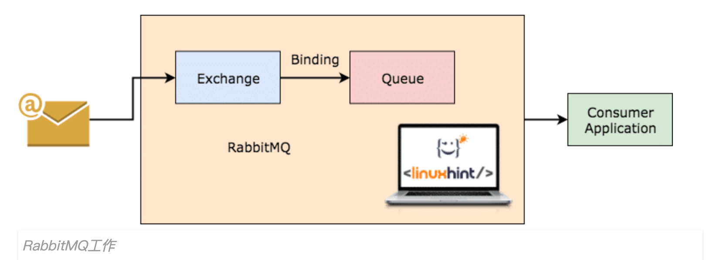
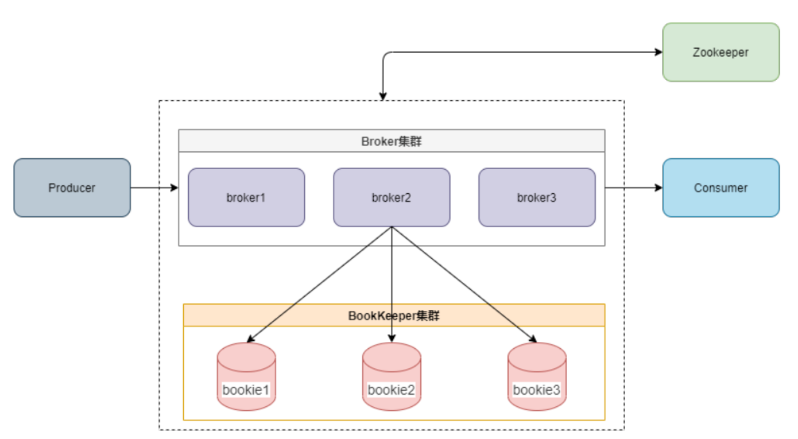

消息队列对比：

（1）kafka 分区管道将事件数据转为带有游标的持久化信息代理

+ 可重读
+ 严格顺序
+ 高吞吐量
+ 基于日志的消息传递

（2）rabbitMQ 以broker为中心，专注生产者与消费者之间的传递保证

+ 不可重读
+ 基于队列的消息传递
+ 负责的路有逻辑 特定生产者的消息到特定的消费者

（3）pulsar

+ 将计算和存储分开，计算由zookeeper管理，存储由bookKeeper管理。并且broker自动负载均衡。扩容非常方便
+ 增加了subsriptionC环节，使得partition和consumer数量一一对应的限制取消
+ 部署起来比较复杂

