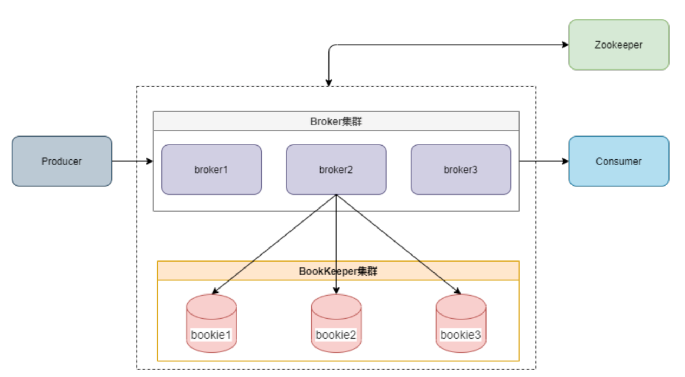

### pulsar

+ 将计算和存储分开，计算由zookeeper管理，存储由bookKeeper管理。并且broker自动负载均衡。扩容非常方便

+ 增加了subsription环节，使得partition和consumer数量一一对应的限制取消

+ 部署起来比较复杂

  

具体细节：

1. producer：

   + 发送：分为同步、异步，异步：将消息放到一个队列里，并立刻返回，然后client在后台自动发送消息

   + 压缩：有几种压缩技术，简介提高消息的吞吐量

   + 批量发送：一次request发送多条消息

2. consumer&subscription

+ subscription：类似于kafka中的consumer group，可以订阅一个或多个topic，并支持exclusive、shared和failover三种消息订阅模式

+ ack：当consumer获取到消息后，会发送ack，表示收到该消息了，于是broker就把这条消息删除；若没有ack，可是重发（需设置）

3. broker&bookie

   

   + 存储单元：ledger，单写只读：single writer，写入bookie后就只能读

     每个broker都是对ledger进行操作，打开一个新的ledger，修改ledger，关闭ledger，放入bookie，另外为了提高性能，每个broker都有ledger的缓存

   + 分区：消息同样可以partition，一个消息可以分成多个partition，分别路由到不同的broker上（但是存储依然在bookie上），用于提高吞吐量和方便定义订阅路由

   + topic：

     name:
   
     ```bash
     {persistent|non-persistent}://tenant/namespace/topic
     ```

     持久化：topic可设置持久化，也可设置为不持久化

     tenant：多租户（没了解）

     namespace：设定策略的作用域范围，后面会说

   + retention：若不想收到ack就删除消息，可以设置retention，即使收到消息也不删除，在一个namespace下起作用

   + TTL：消息的存在时间（time to live），设置消息过期
   
     ```bash
     $ pulsar-admin namespaces set-message-ttl my-tenant/my-ns \
       --messageTTL 120 # TTL of 2 minutes
     ```
   
     


